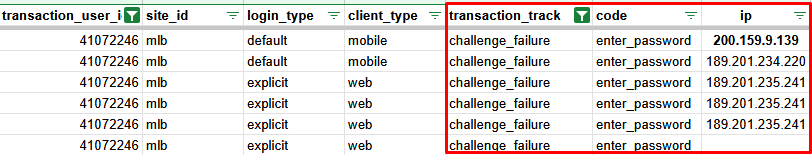
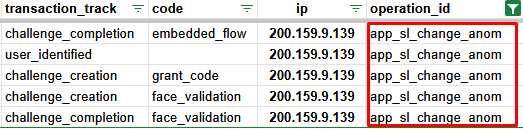
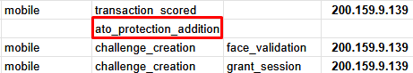
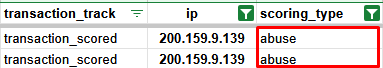

# Log Analysis Report 
A user has reported unusual behavior coming from their account, according to the user there were transactions they did not recognize. 
The objective of this report is to compile relevant information and identify patterns of behavior that might indicate if the user may have been compromised. 

## Log Overview
  - **Transaction account ID:** `41072246`
  - **Date Range of the logs:** `2022-12-11 21:55 - 2022-12-27 17:00`

## Analysis Methodology

This analysis was conducted using custom scripts and manual review. Logs were parsed and filtered to help in the co-validation of User and entity behavior analytics (UEBA), 
which relates to a set of patterns, anomalies, and potential security threats to user accounts and devices.

## Log Analysis

### 1. Anomalous Activity
Examination of the logs from account `41072246` confirms multiple patterns of anomalous behavior strongly suggesting a potential account takeover, as supported by the following detections:

Multiple login failures (challenge_failure) due to invalid passwords were observed from various IP addresses:
- `200.159.9.139`, `189.201.235.241`, `189.201.234.220`.




The system detected multiple anomalies in the application's service level, flagged by the `app_sl_change_anom` operation. This indicates an unusual, unexpected, or 
suspicious change in the service level.




A security measurement `ato_protection_addition` was implemented into the account after the detected anomalous behavior, to ensure its protection.



The log suggests that the account was flagged for a potential Account Takeover (ATO) risk due to multiple patterns of suspicious behavior originating 
from IP address `200.159.9.139` within a short period of time, such as:

```
"trusted_device":false                      # Utilization of untrusted device     
"challenge_resolution_time_in_ms":"42"      # Authentication completed in 45 ms - Indicating automation
"scorings":{"operation":"very_high"}        # High scoring triggered by authentication being performed in 45ms
"new_mobile_domain":true                    # Authentication by unrecognizable device
```

As a result, additional ATO protection measures were added to the account to mitigate the risk. However, it was not as efficient to stop the pattern 
of automated actions from happening. 

By analyzing the 'data' field of the log, multiple `completed_elements` entries were identified. These indicate a possible movimentation from the 
actor through the manipulation of the account settings, indicating successful authentication possibly bypassing MFA steps. 

```
"completed_elements":["enter_password"]                       # Password authentication 
"completed_elements":['face_validation', 'enter_password']    # Authentication using both password and face validation
"completed_elements":['face_validation']                      # Authentication no longer requires password, only face validation. 
```

Multiple `transaction_score` events were flagged with an abuse scoring indicator, suggesting that although the actor may have successfully bypassed authentication methods, the transaction was still identified as potentially fraudulent or abusive based on its risk characteristics.



### 2. Detected Ip Addresses and paterns of Anomalous Behavior

Other than IP address `200.159.9.139`, the following IP addresses also demonstrated patterns of suspicious activity for this account:

| IP Address 	        | Occurrences 	| First Seen 	            | Last Seen 	            | Client Type   |
|:---------------:	  |:-----------:	|:-------------------:	  |:-------------------:	  |:-----------:	|
| `189.201.235.176` 	| 20 	          | `2022-12-24 08:17`      | `2022-12-24 08:13` 	    | mobile     	  |
| `200.159.9.139` 	  | 18 	          | `2022-12-11 21:58`      | `2022-12-11 21:55`      | mobile 	      |
| `189.201.234.220` 	| 14 	          | `2022-12-24 07:39`  	  | `2022-12-24 07:38`   	  | mobile 	      |
| `189.96.19.153` 	  | 6 	          | `2022-12-23 17:48`      | `2022-12-23 17:48`      | mobile 	      |
| `189.201.235.241` 	| 6 	          | `2022-12-27 13:15`      | `2022-12-27 07:22`   	  | mobile 	      |
| `189.201.235.131` 	| 6 	          | `2022-12-22 13:36`   	  | `2022-12-22 13:36`   	  | mobile 	      |
| `189.201.234.8` 	  | 5 	          | `2022-12-21 08:31`      | `2022-12-21 08:31`     	| mobile 	      |

This section summarizes anomalous behavior identified by source IP address. The table quantifies specific suspicious events and lists potential attack patterns inferred from the combined activity.

| IP Address           | Untrusted Devices | Face Validation | New Mobile Domain | Mobile Access | Declined Elements | Potential Attack Patterns                                                                                                |
| :------------------ | :---------------- | :-------------- | :---------------- | :------------ | :---------------- | :--------------------------------------------------------------------------------------------------------------------- |
| `189.96.19.153`     | 5                 | 2               | 6                 | 6             | 1                 | _None Detected_                                                                                                        |
| `200.159.9.139`     | 13                | 4               | 18                | 18            | 5                 | Brute Force/Credential Stuffing<br>Anomalous Behavior/Potential Account Takeover<br>|
| `nan`               | -                 | -               | -                 | -             | -                 | _None Detected / Missing Data_                                                                                         |
| `189.201.235.241`   | 12                | 2               | 6                 | 6             | 7                 | Brute Force/Credential Stuffing                                                                                        |
| `189.201.235.131`   | 5                 | 2               | 6                 | 6             | 1                 | _None Detected_                                                                                                        |
| `189.201.235.176`   | 14                | 2               | 20                | 20            | 13                | Brute Force/Credential Stuffing<br>Anomalous Behavior/Potential Account Takeover                                    |
| `189.201.234.8`     | 1                 | -               | 5                 | 5             | 4                 | _None Detected_                                                                                                        |
| `189.201.234.220`   | 10                | 2               | 14                | 14            | 9                 | Brute Force/Credential Stuffing<br>Anomalous Behavior/Potential Account Takeover                                    |

---


### 3. Final considerations and mitigation points. 
Given the potential attack and the way it has escalonated with multiple suspicious IP addresses, it's secure to gather it as evidence that the security controls might not have
been strong enough for that account. Making it necessary to increase authentication requirements if access patterns appear suspicious.

The logs indicate that while the account may have been compromised, the system successfully identified anomalous behavior in real time. This presents an opportunity for the 
organization to enhance its security posture by implementing stricter policies, such as automatically blocking accounts when multiple indicators of fraudulent activity occur 
within a short timeframe. Proactively leveraging these insights can help mitigate future threats and reinforce overall account protection.

